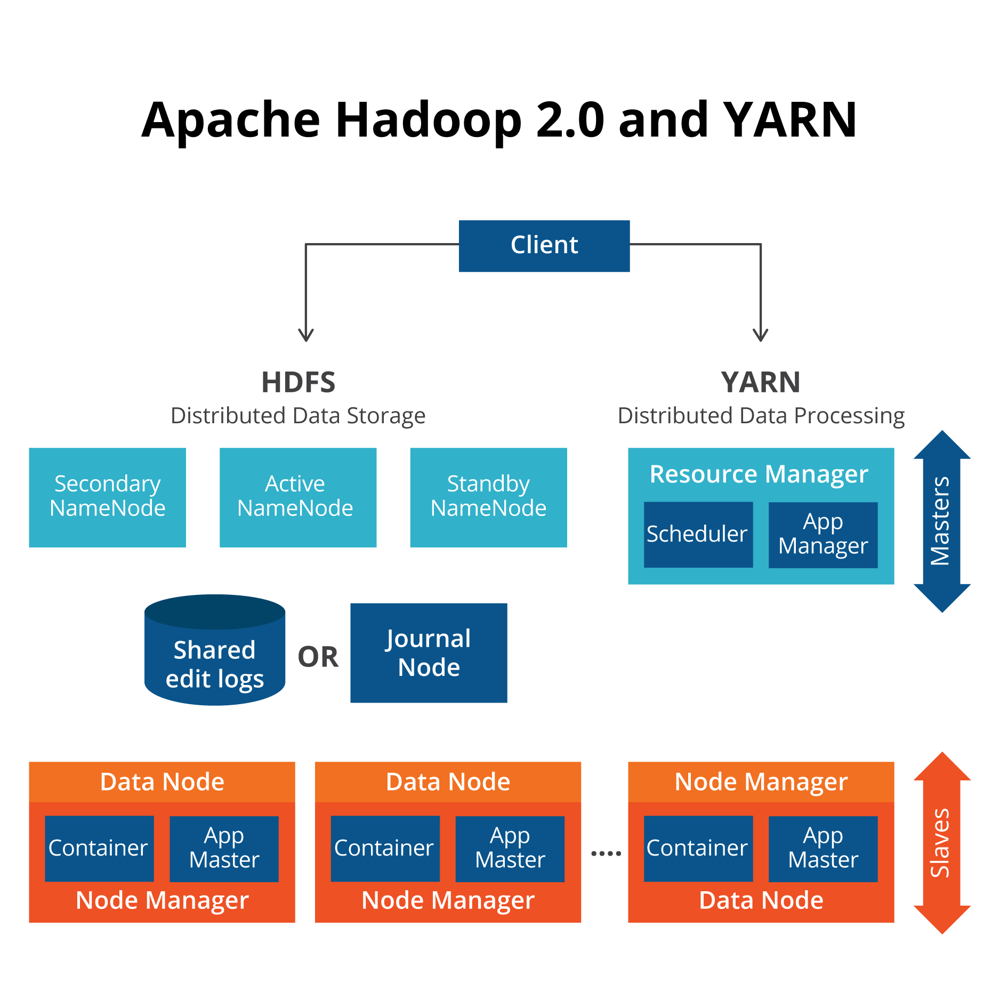

# Hadoop overview
    Hadoop is an Apache open source framework written in java that allows distributed processing of large datasets across clusters of computers using simple programming models. The Hadoop framework application works in an environment that provides distributed storage and computation across clusters of computers. Hadoop is designed to scale up from single server to thousands of machines, each offering local computation and storage.
# Hadoop Architecture
At its core, Hadoop has two major layers namely −

    - Processing/Computation layer (MapReduce), and
    - Storage layer (Hadoop Distributed File System).




# Hadoop install:
   1. Install by File
   2. Install by Docker
        - Docker installation can be verified by

```
           docker --version
```

# Quick commandline: 

# Hadoop tip:


# Hadoop interview

1) Explain all components of a Hadoop application
Following are the components of Hadoop application:

    - Hadoop Common: It is a common set of utilities and libraries that are utilized by Hadoop.
    - HDFS: This Hadoop application relates to the file system in which the Hadoop data is stored. It is a distributed file system having high bandwidth.
    - Hadoop MapReduce: It is based according to the algorithm for the provision of large-scale data processing.
    - Hadoop YARN: It is used for resource management within the Hadoop cluster. It can also be used for task scheduling for users.

2) What is NameNode?
    It is the centerpiece of HDFS. It stores data of HDFS and tracks various files across the clusters. Here, the actual data is not stored. The data is stored in DataNodes.
3) Define Hadoop streaming
    It is a utility which allows for the creation of the map and Reduces jobs and submits them to a specific cluster.
# Link refer:
  - https://www.guru99.com/how-to-install-hadoop.html
  - https://www.guru99.com/data-engineer-interview-questions.html